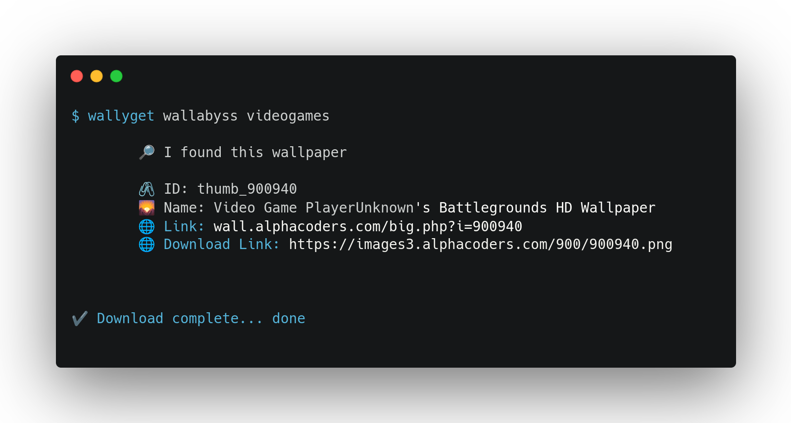

# Wallyget




Wallyget is a wallpaper downloader for Linux.

  Make with ❤️ and Typescript
  by Yoannis Sánchez Soto

## How to Use

Wallyget allow you to download and set a random wallpaper for the defined category with de command:

    wallyget wallabyss [CATEGORY]

It also allow the download of several wallpapers at the sam time with the option:

    wallyget wallabyss  [CATEGORY] -c

All downloaded wallpapers are saved in the Fetched folder, to find out the location of this folder, type:

    wallyget fetched

## Available Sources

Wallyget allows you to download wallpapers from the following sources:

* [Wallpaper Abyss](https://wall.alphacoders.com/)

***More*** coming soon

## Map
<!-- toc -->
* [Wallyget](#wallyget)
* [Usage](#usage)
* [Commands](#commands)
<!-- tocstop -->
# Usage
<!-- usage -->
```sh-session
$ npm install -g wallyget
$ wallyget COMMAND
running command...
$ wallyget (--version)
wallyget/0.0.3 linux-x64 node-v16.17.0
$ wallyget --help [COMMAND]
USAGE
  $ wallyget COMMAND
...
```
<!-- usagestop -->
# Commands
<!-- commands -->
* [`wallyget about`](#wallyget-about)
* [`wallyget bing`](#wallyget-bing)
* [`wallyget fetched`](#wallyget-fetched)
* [`wallyget help [COMMAND]`](#wallyget-help-command)
* [`wallyget wallabyss CATEGORY`](#wallyget-wallabyss-category)
* [`wallyget wallabyss categories`](#wallyget-wallabyss-categories)

## `wallyget about`

Show About

```
USAGE
  $ wallyget about

DESCRIPTION
  Show About

EXAMPLES
  $ wallyget about
```

_See code: [dist/commands/about/index.ts](https://github.com/yossTheDev/hello-world/blob/v0.0.3/dist/commands/about/index.ts)_

## `wallyget bing`

Download wallpapers from Bing

```
USAGE
  $ wallyget bing

DESCRIPTION
  Download wallpapers from Bing

EXAMPLES
  $ wallyget bing
```

_See code: [dist/commands/bing/index.ts](https://github.com/yossTheDev/hello-world/blob/v0.0.3/dist/commands/bing/index.ts)_

## `wallyget fetched`

Show the location of the Fetched folder

```
USAGE
  $ wallyget fetched

DESCRIPTION
  Show the location of the Fetched folder
```

_See code: [dist/commands/fetched/index.ts](https://github.com/yossTheDev/hello-world/blob/v0.0.3/dist/commands/fetched/index.ts)_

## `wallyget help [COMMAND]`

Display help for wallyget.

```
USAGE
  $ wallyget help [COMMAND] [-n]

ARGUMENTS
  COMMAND  Command to show help for.

FLAGS
  -n, --nested-commands  Include all nested commands in the output.

DESCRIPTION
  Display help for wallyget.
```

_See code: [@oclif/plugin-help](https://github.com/oclif/plugin-help/blob/v5.1.10/src/commands/help.ts)_

## `wallyget wallabyss CATEGORY`

Download wallpapers from wall.alphacoders.com

```
USAGE
  $ wallyget wallabyss [CATEGORY] [-c]

ARGUMENTS
  CATEGORY  Category of the wallpaper to download. Type Wallyget Wallabyss Categories to show all available categories

FLAGS
  -c, --collection  Download several wallpapers at the same time and save them in the Fetched folder

DESCRIPTION
  Download wallpapers from wall.alphacoders.com

EXAMPLES
  $ wallyget wallabyss [CATEGORY CODE]
          🔎 I found this wallpaper
  		🖇 ID: "Wallpaper_ID"
  		🌄 Name: "Wallpaper_Name"
  		🌐 Link:  "Wallpaper_Link"
  		🌐 Download Link:  "Wallpaper_Download_Link"
```

_See code: [dist/commands/wallabyss/index.ts](https://github.com/yossTheDev/hello-world/blob/v0.0.3/dist/commands/wallabyss/index.ts)_

## `wallyget wallabyss categories`

Show all available categories for Wallpapers Abyss

```
USAGE
  $ wallyget wallabyss categories

DESCRIPTION
  Show all available categories for Wallpapers Abyss
```
<!-- commandsstop -->
