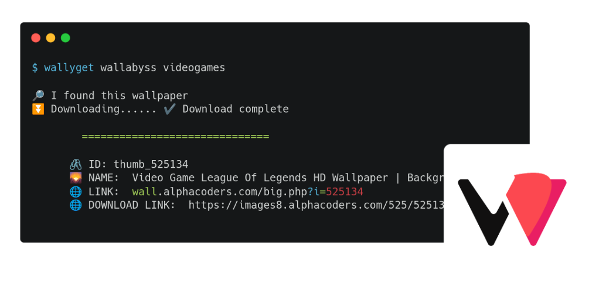

<h1 align="center">Wallyget</h1>



<p align="center">Wallyget is a wallpaper downloader for Linux.
Make with ❤️ and Typescript
by Yoannis Sánchez Soto</p>

📚 Check the docs [here](https://yossthedev.github.io/wallyget/)


## 🚀 Features

* Download wallpapers from different sources like: Bing, Wallabyss, NASA and more coming soon
* Download several wallpapers at the same time
* Easy to use commands

## ⏬ How to Use

Wallyget allow you to download and set a random wallpaper for the defined category with de command:

    wallyget wallabyss [CATEGORY]

It also allow the download of several wallpapers at the sam time with the option:

    wallyget wallabyss  [CATEGORY] -c

All downloaded wallpapers are saved in the Fetched folder, to find out the location of this folder, type:

    wallyget fetched

## 🌐 Available Sources

Wallyget allows you to download wallpapers from the following sources:

* [Wallpaper Abyss](https://wall.alphacoders.com/)
* [Bing Wallpapers](https://bing.com)
* [NASA](https://api.nasa.gov/)

***More*** coming soon

## 👥 Contribution

Any contribution is always welcome. Please let me know of any bugs you detect in MOTS.

## 👨‍💻 Usage

<!-- usage -->
```sh-session
$ npm install -g wallyget
$ wallyget COMMAND
running command...
$ wallyget (--version)
wallyget/0.0.4 linux-x64 node-v16.17.0
$ wallyget --help [COMMAND]
USAGE
  $ wallyget COMMAND
...
```
<!-- usagestop -->

# Commands
<!-- commands -->
* [`wallyget about`](#wallyget-about)
* [`wallyget bing`](#wallyget-bing)
* [`wallyget bing yesterday`](#wallyget-bing-yesterday)
* [`wallyget fetched`](#wallyget-fetched)
* [`wallyget help [COMMAND]`](#wallyget-help-command)
* [`wallyget nasa`](#wallyget-nasa)
* [`wallyget wallabyss CATEGORY`](#wallyget-wallabyss-category)
* [`wallyget wallabyss categories`](#wallyget-wallabyss-categories)

## `wallyget about`

Show About

```
USAGE
  $ wallyget about

DESCRIPTION
  Show About

EXAMPLES
  $ wallyget about
```

_See code: [dist/commands/about/index.ts](https://github.com/yossTheDev/wallyget/blob/v0.0.4/dist/commands/about/index.ts)_

## `wallyget bing`

Download wallpapers from Bing

```
USAGE
  $ wallyget bing [-d <value>]

FLAGS
  -d, --day=<value>  Day of the week to download wallpaper

DESCRIPTION
  Download wallpapers from Bing

EXAMPLES
  $ wallyget bing
```

_See code: [dist/commands/bing/index.ts](https://github.com/yossTheDev/wallyget/blob/v0.0.4/dist/commands/bing/index.ts)_

## `wallyget bing yesterday`

Download yesterday`s Wallpaper

```
USAGE
  $ wallyget bing yesterday

DESCRIPTION
  Download yesterday`s Wallpaper

EXAMPLES
  $ wallyget bing yesterday
```

## `wallyget fetched`

Show the location of the Fetched folder

```
USAGE
  $ wallyget fetched

DESCRIPTION
  Show the location of the Fetched folder
```

_See code: [dist/commands/fetched/index.ts](https://github.com/yossTheDev/wallyget/blob/v0.0.4/dist/commands/fetched/index.ts)_

## `wallyget help [COMMAND]`

Display help for wallyget.

```
USAGE
  $ wallyget help [COMMAND] [-n]

ARGUMENTS
  COMMAND  Command to show help for.

FLAGS
  -n, --nested-commands  Include all nested commands in the output.

DESCRIPTION
  Display help for wallyget.
```

_See code: [@oclif/plugin-help](https://github.com/oclif/plugin-help/blob/v5.1.18/src/commands/help.ts)_

## `wallyget nasa`

Download wallpapers from NASA Astronomy Picture Of The Day

```
USAGE
  $ wallyget nasa

DESCRIPTION
  Download wallpapers from NASA Astronomy Picture Of The Day

EXAMPLES
  $ wallyget nasa
```

_See code: [dist/commands/nasa/index.ts](https://github.com/yossTheDev/wallyget/blob/v0.0.4/dist/commands/nasa/index.ts)_

## `wallyget wallabyss CATEGORY`

Download wallpapers from Wallpaper Abyss

```
USAGE
  $ wallyget wallabyss [CATEGORY] [-c]

ARGUMENTS
  CATEGORY  Category of the wallpaper to download. Type Wallyget Wallabyss Categories to show all available categories

FLAGS
  -c, --collection  Download several wallpapers at the same time and save them in the Fetched folder

DESCRIPTION
  Download wallpapers from Wallpaper Abyss

EXAMPLES
  $ wallyget wallabyss [CATEGORY CODE]
          🔎 I found this wallpaper
  		🖇 ID: "Wallpaper_ID"
  		🌄 Name: "Wallpaper_Name"
  		🌐 Link:  "Wallpaper_Link"
  		🌐 Download Link:  "Wallpaper_Download_Link"
```

_See code: [dist/commands/wallabyss/index.ts](https://github.com/yossTheDev/wallyget/blob/v0.0.4/dist/commands/wallabyss/index.ts)_

## `wallyget wallabyss categories`

Show all available categories for Wallpapers Abyss

```
USAGE
  $ wallyget wallabyss categories

DESCRIPTION
  Show all available categories for Wallpapers Abyss
```
<!-- commandsstop -->
